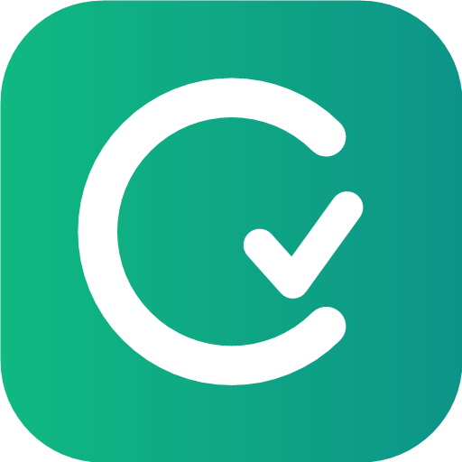

<p align="center">
  <a href="https://cbtwise.com.ng" target="_blank">
    
  </a>
</p>

<h1 align="center">CBTwise — AI-Powered CBT Prep Platform</h1>

<p align="center">
  <b>Comprehensive Computer-Based Test (CBT) Preparation for JAMB UTME, WAEC, NECO, POST-UTME & School Assessments.</b>
</p>

<p align="center">
  
  
  
  
  
  
</p>

---

## 🚀 About CBTwise

**CBTwise** is a modern, high-performance web and progressive web application (PWA) designed to empower Nigerian students preparing for national standardized exams including **JAMB (UTME)**, **WAEC (SSCE)**, **NECO**, and **Post-UTME**.

Built with Laravel 12, Livewire 3, Alpine.js, and Tailwind CSS, CBTwise delivers an authentic exam-room experience, AI-assisted learning tutors, detailed analytics, affiliate referral systems, and school management tools.

---

## ✨ Key Features

- **Authentic Exam Simulator**: Replicates actual JAMB & WAEC CBT timer, calculator, navigation grid, and question flag interface.
- **AI Tutor Assistant**: Instant AI explanation for complex questions powered by OpenAI.
- **Progressive Web App (PWA)**: Installable on Android, iOS, and Desktop for fast offline/online study access.
- **Livewire 3 SPA Experience**: Dynamic real-time interactions without full page reloads.
- **Affiliate & Referral System**: Referral link generation, code redemption, and commission tracking.
- **School & Institution Portal**: Bulk access licensing, student management, and performance tracking.
- **Automated Payment Gateway**: Integrated with **Paystack** for seamless subscription and code activation.
- **Real-Time Notifications & Queues**: Powered by Laravel Reverb and Horizon.
- **Nightly Analytics & ETL Pipeline**: Scheduled data processing for leaderboards, study streaks, and performance analytics.

---

## 🛠 Tech Stack

- **Backend Framework**: Laravel 12.x (PHP 8.3+)
- **Frontend Framework**: Livewire 3 + Alpine.js
- **Styling**: Tailwind CSS 3.4
- **Database**: MySQL / SQLite
- **Queue & Monitoring**: Laravel Horizon & Redis
- **Real-time WebSockets**: Laravel Reverb
- **AI Integration**: OpenAI API
- **Payments**: Paystack API
- **SMS / WhatsApp Services**: ALOC API Integration

---

## 📦 Installation & Local Setup

### Requirements
- PHP >= 8.3 (with `pdo`, `mbstring`, `openssl`, `gd`, `bcmath`, `curl` extensions)
- Composer >= 2.x
- Node.js >= 18.x & NPM
- MySQL 8.0+ or SQLite

### Setup Steps

1. **Clone Repository**
   ```bash
   git clone https://github.com/binsani/cbtwiseapp.git
   cd cbtwiseapp
   ```

2. **Install PHP Dependencies**
   ```bash
   composer install
   ```

3. **Install NPM Packages & Compile Assets**
   ```bash
   npm install
   npm run build
   ```

4. **Configure Environment**
   ```bash
   cp .env.example .env
   php artisan key:generate
   ```
   *Edit `.env` to set your Database, Paystack, OpenAI, and SMTP details.*

5. **Run Migrations & Seeders**
   ```bash
   php artisan migrate --seed
   ```

6. **Serve Application**
   ```bash
   php artisan serve
   ```
   Access the app at `http://localhost:8000`.

---

## ⚙️ Production Deployment Commands

```bash
# Optimize configuration, routes, and views
php artisan config:cache
php artisan route:cache
php artisan view:cache

# Run database migrations
php artisan migrate --force

# Start Horizon background worker
php artisan horizon
```

---

## 🛡 Security

If you discover any security vulnerabilities within CBTwise, please notify the development team directly at `hello@cbtwise.com.ng`.

---

## 📄 License

CBTwise is proprietary software. All rights reserved.
